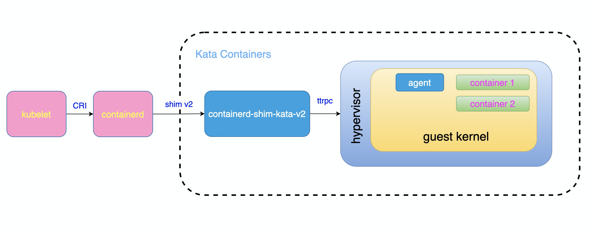

# Kata Containers 架构

## 概要

Kata Containers 架构可以概括地使用下图进行说明：

在这张图中，我们可以将整个生态系统分为 3 部分：

- 容器调度系统（如 K8s）
- 上层 runtime，这一层主要是实现了 CRI 接口，然后使用下层 runtime 对容器进行管理。上层 runtime 典型代表有 containerd 和 CRI-O。
- 下层 runtime，这一层才会直接负责容器的管理，典型代表为 runc 和 Kata Containers。

对 Kata Containers 来说，Kata Containers 会接收来自上层 runtime 的请求，实现容器的创建、删除等管理工作。

同时，上图中也有 3 个通信协议存在：

- CRI： 容器运行时接口，这是 k8s（实际上是 kubelet）和 上层 runtime 之间的通信接口
- shim v2：上层 runtime （如 containerd ）和 下层 runtime（如 Kata Containers ） 之间的通信接口
- agent 协议：这是 Kata Containers 内部的协议，用于 Kata Containers 的 shim 进程和 guest 内的 agent 之间的通信。
