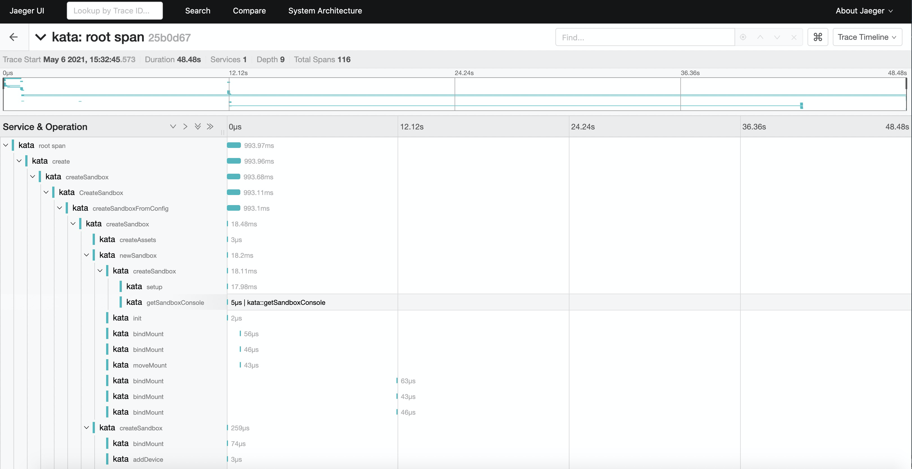

# 使用 Jaeger 输出 Kata Containers 的 Trace

这个实例介绍了如何在宿主机上运行 Jaeger 容器，并将本机上运行的 Kata Containers 容器的 trace 信息发送到本地 jaeger collector。

## 启动 jaegre

使用 Docker 来运行 jaeger 是非常方便的方式。

```
$ docker run -d --name jaeger \
  -e COLLECTOR_ZIPKIN_HOST_PORT=:9411 \
  -p 5775:5775/udp \
  -p 6831:6831/udp \
  -p 6832:6832/udp \
  -p 5778:5778 \
  -p 16686:16686 \
  -p 14268:14268 \
  -p 14250:14250 \
  -p 9411:9411 \
  jaegertracing/all-in-one:1.22
```

## 配置 Kata Containers

### 启用 runtime 的 trace

开启 runtime 侧的 trace ：

```
[runtime]
enable_tracing = true
jaeger_endpoint="http://x.y.z.a:14268/api/traces"
```

其中 Jaegere collector 地址需要根据实际情况填写。

### 启用 agent 的 trace


开启配置：

```
[agent.kata]
enable_tracing = true
trace_mode = "static"
```

现在 `trace_mode` 只支持一种 `static` 模式（ https://github.com/kata-containers/kata-containers/issues/420 ）。


#### 启动 trace forwarder

目前 agent 需要依赖 trace forwarder 组件将 trace 转发到 Jaeger，要想输出 agent 的 trace ，需要先启动 trace forwerder 组件。

进入到 `src/trace-forwarder` 文件夹，输入 `make` 命令既可以编译 trace forwarder ，编译后的结果为 `target/debug/kata-trace-forwarder` 。

`kata-trace-forwarder` 有如下几个参数（可通过 `kata-trace-forwarder -h` 获得）：

```
        --jaeger-host <jaeger-host>    Jaeger host address [default: 127.0.0.1]
        --jaeger-port <jaeger-port>    Jaeger port number [default: 6831]
    -l, --log-level <log-level>        specific log level [default: info]  [possible values: trace, debug, info, warn,
                                       error, critical]
        --trace-name <trace-name>      Specify name for traces [default: kata-agent]
        --vsock-cid <vsock-cid>        VSOCK CID number (or "any") [default: any]
        --vsock-port <vsock-port>      VSOCK port number [default: 10240]
```

如果 `kata-trace-forwarder` 和 Jaeger 在同一台机器上，则可以不使用任何参数启动 trace forwarder ，否则需要指定 Jaeger 的链接信息。

### 创建容器

按照下面的步骤创建并删除 Pod/container：

```
$ p=`crictl runp -runtime kata pod.yaml`
$ c=`crictl create $p container.yaml pod.yaml`
$ crictl start $c
$ crictl stop $c
$ crictl stopp $p
$ crictl rmp $p
```

然后到 jaeger 界面（`http://your server:16686`）就可以看到 名为 `kata` 的服务所产生的 trace 了。



