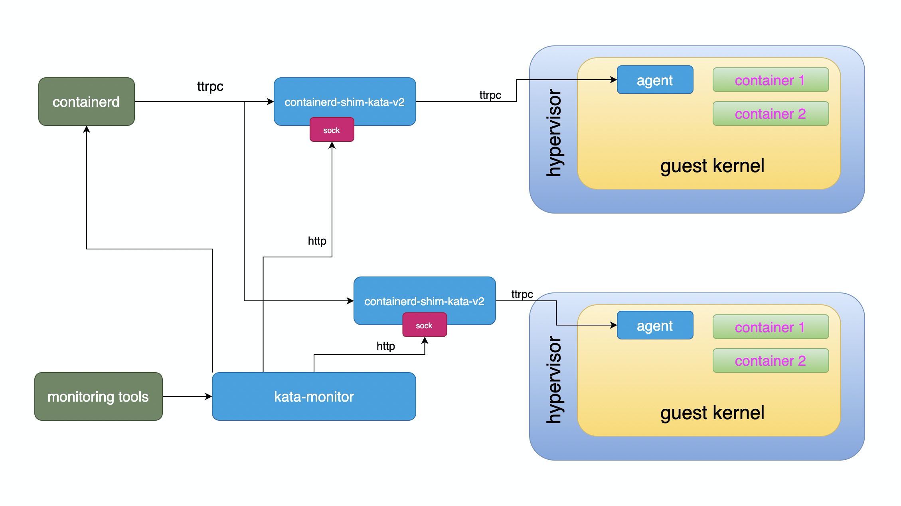

# Runtime 代码解析

runtime 为运行在宿主机上的、支持 shim v2 协议的进程。在这系列文章中，多数情况下可以将 runtime 、shimv2 视为同一内容。

## Runtime 概要

Runtime 大致架构如下图所示：



整个 Runtime ，其可执行程序为 `containerd-shim-kata-v2`，也即 shim 进程，这也是 Kata Containers 的入口点。Runtime 对上接受 containerd 的请求（通过 shimv2 “协议”），对 guest 来说，通过 guest 内的 agent 来控制 guest 内容器的创建、删除等管理。

Runtime 和 agent 之间的采用了 ttrpc 协议通信，这是一个使用了 protocol buffer 编解码方式的类似 gRPC 的通信方式。该协议由 containerd 创建，用于 containered 和底层 runtime 之间的通信。在 Kata Containers 中， runtime 和 agent 也通过 ttrpc 通信。

## Packages 介绍

Runtime 代码在 src/runtime 下，主要由如下几个 package

### cli

这个包下主要定义了各个构建出来的二进制可执行文件的 main 函数，有如下几个：
- `containerd-shim-kata-v2`
- `kata-runtime`
- `kata-monitor`

### containerd-shim-v2

这个包是实现了 shim v2 协议的 ttrpc server 的入口，具体容器、sandbox 的操作，则使用了 pkg 和 virtcontainers 两个包下的实现。

### virtcontainers

这里是 Kata Containers 中的核心实现代码，主要是通过对 hypervisor 和 guest 的管理，实现标准的容器操作接口。

### pkg

包括了一些基本的帮助函数。


### 到底 runtime 名字怎么写？

在 K8s 和 containerd 中，我们会看到很多用于设置 runtime 的地方，比如 `RuntimeClass` 、Pod 的 `runtimeClassName` 定义，以及 `ctr run --runtime io.containerd.run.kata.v2` 和 `crictl runp -r kata` ，里面都有参数指定运行时的名字。

runtime 的名字和可执行程序之间的名字是有一个对应关系的，这样 containerd 这样的高级 runtime 就能找到 shimv2 二进制并启动 shimv2 进程。

其解析过程大致如下：

- Pod 的 `runtimeClassName` 属性会查找同名的 `RuntimeClass` 资源
- 根据 该资源的 handler ，在 containerd 的配置文件查找相应的运行时（ [plugins.cri.containerd.runtimes.${HANDLER_NAME}] ）。

一般情况下 containerd 配置会像这样：

```
[plugins.cri.containerd.runtimes.kata]
  runtime_type = "io.containerd.kata.v2"
```

从上面不难看出另外两个结论：

- ctr 命令使用的是 containerd 配置文件中的 `runtime_type` 属性（ containerd 用）。
- crictl 和 K8s（实际也是 CRI 接口） 使用的是 containerd 配置中的 HANDLER_NAME（ CRI 用）。


默认情况下，containerd 会根据 `runtime_type` 按规则对应到具体的运行时的可执行文件名。比如 Kata Containers 运行时最终会转换为 containerd-shim-kata-v2 命令，该命令默认安装在 /usr/local/bin/containerd-shim-kata-v2 。

具体 containerd 的转换规则可以参考[这里](https://github.com/containerd/containerd/tree/master/runtime/v2#binary-naming)的说明。

