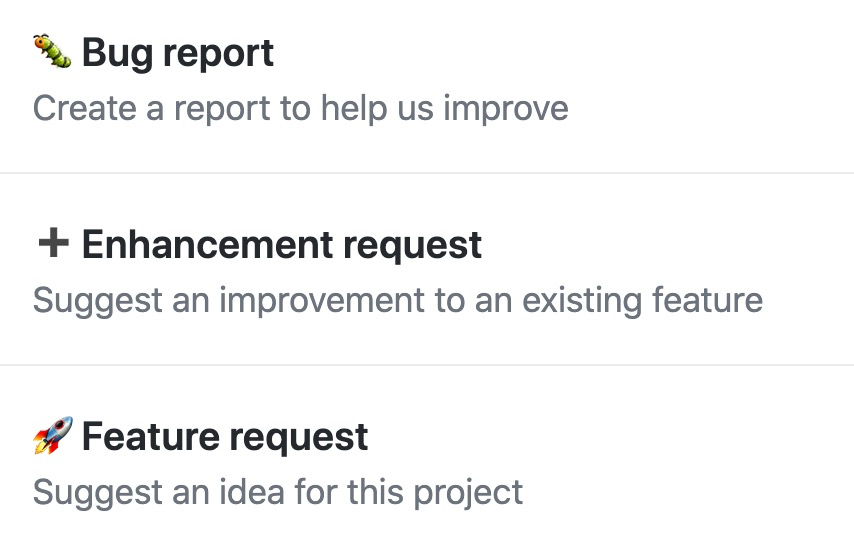
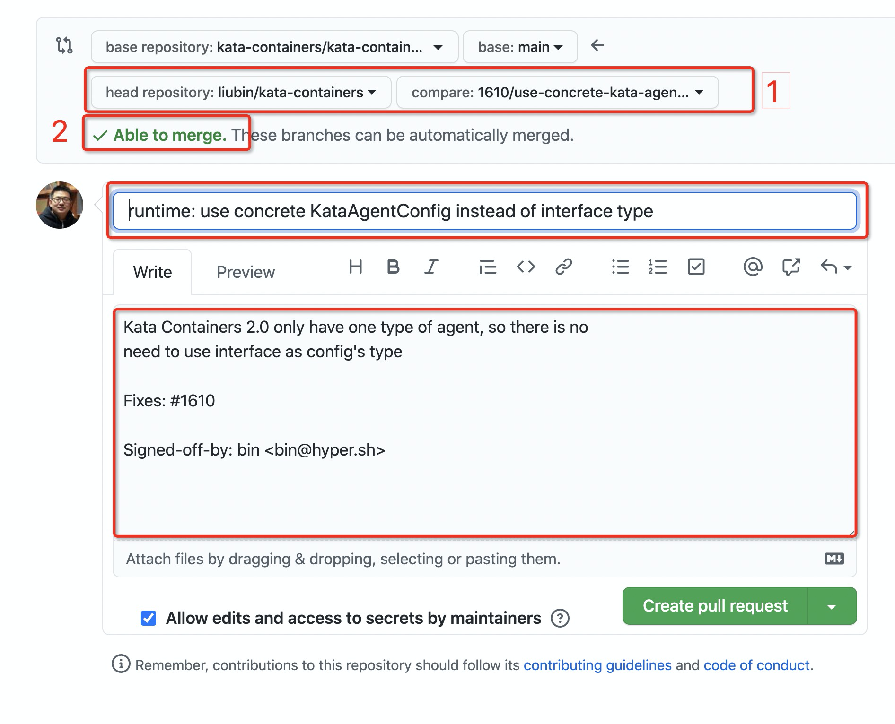
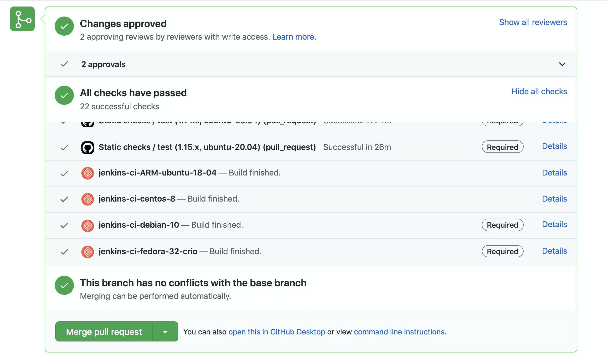

# 第一个 Kata Containers 的 PR

终于到了该介绍如何在 Kata Containers 社区提交自己的 PR 了，可能有些人已经等不及了。读完这一章，你也可以尝试着提交个 PR 试试。

## 如何找到 issue

要想提交 PR，首先得确定要修改什么。

在 Kata Containers 社区通过 GitHub 的 issue 和 PR 来管理 bug 和合并请求。首先要有一个 issue，然后以此创建自己的开发分支，在本地开发、测试通过后，就可以提交 PR 到社区并获得项目维护者的 review，如果没有问题，就可以合并代码了。


大概有如下几种情况：

- 有人提了 issue，可以去 Kata Containers 的 issue 页面查找自己感兴趣的去 fix
- 自己使用中发现的 bug
- 自己需要的功能
- 学习、阅读源代码时候发现的问题

对于上面在阅读源代码时候发现的问题，也不完全都是 bug，也可以是简单的 typo，不合适的变量名，各种类似 golint 等对代码质量和阅读性上有影响的代码等，都可以作为修正对象。

在这篇文章中，我们以在阅读代码时发现的一个小改进为例，来看一下整体 PR 从提交到合并（merge）的过程 。

## 准备工作

### 配置 git

首先，需要对 git 进行简单的配置。

如果你的开源项目和工作项目需要分开，或者有多个账号要分开使用，那么推荐为不同的项目仓库配置不同的 git 用户信息（即标志一个代码贡献者）。

```
$ git config --local user.name zhangsan-lisi
$ git config --local user.email zhangsan-lisi@gmail.com
```

如果你已经设置了全集的用户信息（通过 `--global` 选项），并且不想单独设置不同的账号，则这一步可以省略。

## 开始我们的工作

介绍了一些提交 PR 的基础知识和前提，下面我们来进入真实的操作过程。

### 找到问题

在阅读源代码的时候，我们发现 `kata_agent.go` 中的 [`internalConfigure(h hypervisor, id string, config interface{})`](https://github.com/kata-containers/kata-containers/blob/594c47ab6c548f4fab0bb38f699f77791c141fbb/src/runtime/virtcontainers/kata_agent.go#L371)，参数 config 是一个 interface 类型，而实际函数内部，这个 interface 貌似只有一种具体类型：

```go
func (k *kataAgent) internalConfigure(h hypervisor, id string, config interface{}) error {
	var err error
	if config != nil {
		switch c := config.(type) {
		case KataAgentConfig:
			if k.vmSocket, err = h.generateSocket(id); err != nil {
				return err
			}
			k.keepConn = c.LongLiveConn
		default:
			return vcTypes.ErrInvalidConfigType
		}
	}

	return nil
}
```

我们可以看到，这个参数只有一种实现的具体类型，感觉没有什么必要非得定义成一个接口。


> **Note:** 在 Kata Containers 1.x 中有多种类型的 agent，所以在给 agent 是有的配置类型中，使用了接口定义。

所以，我们可以尝试将这一类方法中的 config 从接口类型改为具体的 `KataAgentConfig` 类型。

按照各函数的调用关系，我们可以找到 `src/runtime/virtcontainers/agent.go` 中 agent 接口的如下方法都需要修改：

- configure
- configureFromGrpc

最后修改的文件包括如下几个：
- src/runtime/virtcontainers/agent.go
- src/runtime/virtcontainers/kata_agent.go
- src/runtime/virtcontainers/mock_agent.go

如果能成功通过编译和测试，就可以大致验证我们的修改没有问题，因为我们没有修改任何逻辑和流程相关的内容，只是改了一下函数签名。

之后我们就可以准备提交代码了。只是按照现在的流程，在提交 PR 之前，需要先创建 issue。

### 创建 issue

在 [issue](https://github.com/kata-containers/kata-containers/issues) 页面点击 [New Issue](https://github.com/kata-containers/kata-containers/issues/new/choose) 按钮，就可以看到下面的页面。



在 Kata Containers 中 issue 分为如下 3 类：

- Bug report：影响正常工作和使用的问题
- Enhancement request：虽然也能用，但是还有改进和优化
- Feature request：完全新的功能。

这里我们只是一个小小的代码改进，所以选择第二种的 **Enhancement request**。

默认创建 issue 页面提供了一个简易的模板，也可以使用自己的自由格式来描述。

主要包含包括如下一些信息：
- 要干什么
- 为什么要干
- 如何干

当然，issue 内容也可以比这更详细。总之根本原则之一就是要描述准确，让别人读完能理解即可。

最后我们创建的 issue 在[这里](https://github.com/kata-containers/kata-containers/issues/1610)。

### 修改代码

#### 同步最新代码

在创建完 issue 之后，就可以开始准备修改代码了。

首先，修改代码前需要确保自己的代码是和 upstream 同步的，即保证自己 fork 的仓库和 Kata Containers 的仓库代码一致。这个可以通过如下命令实现：

```
$ git checkout main
$ git remote add upstream https://github.com/kata-containers/kata-containers.git
$ git fetch upstream
$ git merge upstream/main
```

#### 创建 PR 分支

首先，每一个 PR 都需要有一个单独的分支，推荐使用有意义的分支名，比如可以使用如下格式：

```
<issue_id>/<pr-summarty>
```

比如我们这里使用如下命令创建新的分支。

```
$ git checkout -b 1610/use-concrete-kata-agent-config-type
Switched to a new branch '1610/use-concrete-kata-agent-config-type'
```

我们基于最新的代码创建了一个新的分支 `1610/use-concrete-kata-agent-config-type`，并在此分支上修改代码。


#### 修改代码


```
$ make
$ make test
```

#### 提交代码


确认代码没有问题之后，就可以提交代码了。

```
$ git add .
$ git commit -s
```

`commit` 的 `-s` 参数用于 `Signed-off-by` 信息，这是 Kata Containers 的 commit 中需要遵循的规则。


比如这个例子中，我们输入的内容如下。

```
runtime: use concrete KataAgentConfig instead of interface type

Kata Containers 2.0 only have one type of agent, so there is no
need to use interface as config's type

Fixes: #1610

Signed-off-by: bin <bin@hyper.sh>
```

可以看出提交信息由 4 部分组成：

- 标题。这部分由 subsystem: commit summary 组成，根据具体的 pr 内容填写
- body 部分。和上面的标题隔开一行，记录具体的修改内容，用于对标题进行补充说明。可以是问题背景、如何修改、注意事项、以及其他参考资料等。
- fix 的 issue 编号。这部分以 `Fixes: ` 开始，后面跟 issue 编号，如果有多个 issue， issue 之间用逗号分隔。
- Signed-off-by：这部分通过 `commit -s` 自动填写。

另外，Fixes 也可以指定仓库名，使用如下方式：


```
Fixes: github.com/kata-containers/kata-containers#1234
```

代码提交到本地后，下一步是需要 push 到 GitHub 的自己仓库之下。

首先我们可以不带参数尝试 push 一下：

```
$ git push
```

我们会看到默认的情况下这会失败，因为本地新建的分支还没有对应的远程分支。错误消息也会提示我们如何去做：

```
fatal: The current branch 1610/use-concrete-kata-agent-config-type
 has no upstream branch.
To push the current branch and set the remote as upstream, use

    git push --set-upstream origin 1610/use-concrete-kata-agent-config-type
```

直接使用错误信息中提示的命令推送即可：

```
$ git push --set-upstream origin 1610/use-concrete-kata-agent-config-type
```

#### 创建 PR

代码推送到了自己 fork 的仓库后，就可以创建 pr 了。

到 Kata Containers 的 [pr 页面](https://github.com/kata-containers/kata-containers/pulls) ，如果我们刚才 push 了分支到 fork 的仓库，这个页面会智能的提示你有新分支可以用了创建 pr，如下图所示：


直接点击 **Compare & pull request** 就可以进入到创建 pr 的页面了。如果没有上面的提示也没关系，你也可以点击 [New pull request](https://github.com/kata-containers/kata-containers/compare) 进入这个页面。

创建 pr 的页面大致元素如下：



默认这个页面会使用代码中的提交信息分支填充一些信息。我们这里只有一个 commmit ，因此不需要做额外的修改就可以直接创建 pr ，如果你的 pr 修改内容很多，可能需要自己根据实际情况来补充完整。


上图 “1” 处表示的是从自己 fork 的仓库合并到 Kata Containers 的仓库， “2” 里绿色的 **Able to merge** 表示代码没有冲突，可以合并到目标分支（这里为 `main` 分支）。如果你这里显示的不是这样的结果，可能需要重新 rebase 一下主分支，以确保是在最新的代码上做的修改。

最后我们创建的 pr  在[这里](https://github.com/kata-containers/kata-containers/pull/1612)。


要想让你的代码获得合并，必须满足如下两个条件：

- 所有必须的 CI 测试通过
- 有 2 个或 2 个以上的项目维护者的 approve 。

#### CI 检查

CI 分两大类

- 使用 GitHub Action 的各种构建、静态检查和 UT 等验证
- 基于 Jenkins 的集成测试，包括基于最新代码和PR修改内容的所有组件的构建、各种环境（K8s、contaienrd、CRI-O、VFIO、QEMU、CLH、Firecracker等）的真实负载测试

对于各种静态检查，常见的问题有如下：

- commit message 不符合标准
- 没有代码格式化
- 单测不通过

对于这类错误，在 pr 页面底部的状态详情部分都会显示出来。对于失败的检查，可以点击后面的 **Details** 链接查看具体的错误信息。


如果真的有 CI 检查的错误，需要修正这些错误后，再次提交代码。这时候可以在原提交的基础上使用 `--amend` 重新提交，并使用 `push -f` 来强制更新远程分支。

在所有检查都通过后，就可以等待其他人的 review 和集成测试的结果。

#### 代码 review

具有 review 权限的 Kata Containers 维护者负责 reivew 所有的 pr。有任何问题，他们都会直接在 GitHub 上以 comment 的情况提出来。 按 comment 需要进行的处理方式，主要分为两类：

- 讨论类
- 修正类

讨论类一般指 reivew 者所提出的疑问，比如这里为什么这么实现等。这类问题需要 pr 提交者进行回答和解释。

修正类指的是确实代码或文档存在错误，或可以改进的地方，这类问题需要 pr 提交者重新修改代码，提交后更新 pr 的内容。

#### 集成测试

集成测试由项目维护成员来通过 `/test`/`/test-ubuntu` 等指令触发。集成测试有两种错误，一种是由于环境导致的错误，比如网络暂时的不可用等，这类错误都是可以重试的。另一类就是确实代码有问题，没有得到预期的结果，导致功能测试失败。这类错误需要 pr 提交者调查、修正后重新提交代码。

集成测试的代码都在 [`kata-containers/tests`](https://github.com/kata-containers/tests) 下，每种测试都需要在全新的环境下从源代码开始构建各种二进制、guest 镜像等测试对象，所以整个耗时一般都在 30 - 60 分钟。

当然，如果只是修改了文档的话，则集成测试会很快返回，不会进行没有必要的测试。具体实现和方法可以参考 [tests 仓库的 `ci-fast-return.sh` 文件](https://github.com/kata-containers/tests/blob/main/.ci/ci-fast-return.sh) 。

集成测试采用了 Jenkins 执行，每个测试任务的日志都可以在任务页面的 [Build Artifacts] 中找到，主要包括如下内容：

- kubelet 日志（如果包括 k8s 测试的话）
- containerd 日志（如果使用了 containred 的话）
- CRI-O 日志（如果使用了 CRI-O 的话）
- kernel 日志
- containerd-shim-kata-v2 日志
- kata-collect-data：测试技术后收集的系统（操作系统+额外依赖的软件+Kata Containers）信息

如果测试失败，可以下载相应的日志进行调查。

#### 代码修改

不管是 reivew 人员指出的错误，还是在 CI 测试中发现的错误，都需要开发者在本地重新修改代码。

如果只有一个提交，可以直接使用 `git commit --amend` 和 `git push -f` 即可。如果是一个 pr 多个提交，则可能需要找到相应的提交进行 `--amend` 处理，本文中不对这样的例子进行说明。

> **关于提交粒度：**对于比较大的 pr ，建议以单个功能点、单个顶层文件（src/runtime, src/agent, docs）分开提交，同时需要确保每个 commit 都能编译通过。

#### 代码合并

如果所有必须的 CI 检查和测试都通过，也有足够数量的（目前是 2 人）项目维护者 approve 了 pr，则 pr 就可以合并了。合并只能有项目维护者执行。

合并前的 pr 状态是这样的：



从上图中，我们可以看到：

- **Changes approved：** 表示已经有足够多的项目维护者 approve 了代码
- **All checks have passed：** 所有的 GitHub actions 检查、CI 集成测试都通过

这时候，具有合并代码权限的项目维护者就可以通过 **Merge pull request** 按钮合并 pr 了。

代码合并后，对应的 issue 就自动的被 close 掉了。如果没有自动 close，则需要手工来 close 这个 issue。
Issue close 后，就算完成了一个简单的 pr 从开始修改、创建到合并的全部流程。

### 一些小技巧

很多项目维护者并不是专注于某一 issue 或 pr ，所以必要的时候，可能需要 pr 提交者主动“催”一下，可以在 pr 的 comment 栏里使用 `@` 来提醒你想要联系的项目维护者。

## 小结

这里我们以一个实例来介绍了如何创建一个 issue ，并进行修改、提交 pr，直到最后代码合并。当然这里是一个简单的 pr 流程，中间没有太多的变动。实际情况，根据 pr 的复杂程度和重要性，整个持续过程可能会达到数周或超过一个月甚至更久，可以说是一场持久战，这段时间都需要代码提交者和 reivew 者经过多次的讨论和确认，才能最终实现代码的合并，这也是一项考研持久性和耐力的活动。当然，毕竟这样的 pr 还是很少的。